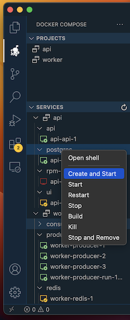

# Docker Compose

Docker Compose Extension for Visual Studio Code

## Features

* Manage Compose projects (Up, Down).
* Manage Compose services (Up, Shell, Attach, Start, Stop, Restart, Build, Kill, Down).
* Manage Compose services's containers (Attach, Start, Kill).
* Multi-root support.

## Requirements

* [Docker](https://www.docker.com/)
* [Docker Compose](https://docs.docker.com/compose/)

## Usage

* Docker Compose Explorer

## Extension Settings

The extension contributes the following settings:

* `docker-compose.autoRefreshInterval`: Interval (in milliseconds) to auto-refresh containers list. Set 0 to disable auto-refresh. (Default is `10000`)
* `docker-compose.projectNames`: Override Docker Compose project name for each workspace root (Default is basename of the workspace directory).
* `docker-compose.showExplorer`: Show Docker Compose explorer view. (Default is `True`)
* `docker-compose.files`: Docker Compose files. You can define array of files. (Default is `["compose.yaml", "compose.yml", "docker-compose.yaml", "docker-compose.yml"]`).
* `docker-compose.shell`: Specify shell to use inside Docker Container. (Default is `"/bin/sh"`).

## Known Issues

The extension is in early stage. Feel free to report bugs.

## Release Notes

### 0.3.5

* Keep environment variables on command execution
* Project name normalisation fix
* Custom container names fix

### 0.3.4

* Container healthy icon

### 0.3.3

* Windows folders path fix

### 0.3.2

* Containers loop fix
* New service icons

### 0.3.1

* Find docker compose ps separator fix

### 0.3.0

* Better executor exceptions handling
* Refresh nodes on child process exit event
* Container logs command

### 0.2.3

* Activity bar
* Activation events fix

### 0.2.2

* Commands rename fix

### 0.2.1

* List services error handing fix
* Up service attached

### 0.2.0

* Tree view explorer
* Multi-root support
* Service's containers support
* Refresh performance increased

### 0.1.1

* Attach and shell commands added

### 0.1.0

Initial release
